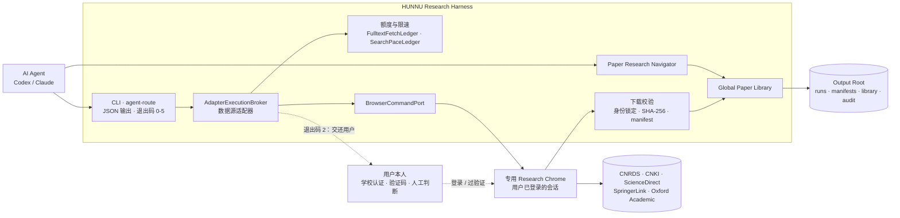

# HUNNU Research Harness v0.3.6

**一个面向经管实证研究、"人在环路"的科研自动化框架。** 学校统一认证、验证码和需要判断的地方，永远交给研究者本人；登录之后那些机械但不能出错的操作（数据库下载、文献检索与全文获取、入库归档、文献查找），交给 AI agent，但 agent 只能走 Harness 提供的受控接口，每一步都有校验、记账和审计。

Python 3.11+ · Playwright · Windows + Chrome · 1300+ 项自动化测试 · GPL-3.0

> **给安装 Agent：** 拿到 zip 后直接跳到下方[安装](#安装)一节逐步执行；开始干活前先读完 [AGENTS.md](AGENTS.md)。

## 它解决什么问题

做实证研究，要在学校购买的数据库和出版商网站之间反复往返：登录、检索、核对、下载、改名、归档，过段时间再把文献找回来。每一步都不难，但都不能错：下错一篇、重复下载、被出版商判为异常流量，代价都落在研究者自己的机构账号上。

直接让 agent 去"点网页"，问题恰恰出在这里：它会把"没看清"当成"没有"，把"被拦住"当成"失败了再试一次"。Harness 的做法是把人和机器的边界画清楚，并且让边界由代码守住，而不是靠 agent 自觉。

## 接口一览

| 类别 | 接口 | 能力 |
|---|---|---|
| 金融数据库 | **CNRDS** 中国研究数据服务平台 · CNFS 财务报表 | 资产负债表、利润表、现金流量表；操作前校验数据库 / 模块 / 表状态，原始文件留档并计算 SHA-256 |
| 中文文献 | **CNKI** 中国知网 | 检索、全文权限判断、授权下载；兼容 2026 年新版与旧版两套页面 |
| 英文文献 | **ScienceDirect**（Elsevier）· **SpringerLink** · **Oxford Academic** | 检索、全文权限判断、授权下载、多来源预检、无人值守下载；ScienceDirect 能识别出版商的拒绝页并停下 |
| 机构访问 | 湖南师范大学图书馆数据库导航 | 从图书馆入口解析到出版商的机构访问路由，带身份锁定；校外 CARSI 登录入口不作为自动路由 |
| 公开证据 | **OfficialWeb** | 期刊投稿须知等公开官方网页，按域名白名单取证；遇登录、验证、付费墙即停 |
| 文献库 | **Global Paper Library** | 去重、同一作品多版本、SHA-256、入库自动主题分类 + 人工确认溯源、受控外部导入 |
| 文献导航 | **Paper Research Navigator**（9 个 `paper-*` 命令） | 中英跨语言检索、相关文献、阅读包、本地覆盖缺口分析、引用核验 |
| Agent 接入 | `agent-route` · `capabilities` · `doctor` | 结构化请求路由与无网络 dry-run；所有命令支持 `--json`；分级退出码 0–5 |

## 设计要点

1. **人工闸门。** 遇到登录、验证码、MFA 或出版商的拒绝页，一律停下，以退出码 2 把控制权交还用户。不输入密码，不读取、不导出 cookie，不自动操作任何验证。
2. **写前记账的下载额度。** 每次全文下载前先落账：每日总量默认 15（用户自己的旋钮），同一篇每天最多 2 次（防循环，不可调），下载之间至少间隔 15 秒、10 分钟内最多 12 次。先记账再下载，所以中途失败的下载也算数，不会因为"没成功"被反复重试。
3. **跨进程检索限速。** 检索之间至少 20 秒、10 分钟内最多 6 次；状态落盘，多个进程共享。这条来自一次真实教训：几分钟内从 7 个独立进程各发一次检索，会话被出版商封了两次。
4. **不把"判断不了"报成结论。** 无法判定全文权限 ≠ 出版商拒绝；读不到页面 ≠ 验证页已消失；零结果 ≠ 撞到了验证页。每一种都有单独的状态和测试。
5. **身份锁定与可追溯。** 检索结果与详情页、下载文件与目标论文逐一核对 DOI / 标题；原始文件留档、计算 SHA-256，生成不含任何凭据的 manifest。
6. **代码与数据分离。** 所有运行产物写在仓库外的 Output Root，代码目录里没有任何学校数据。
7. **给 agent 的规则有执行审计。** [AGENTS.md](AGENTS.md) 共 74 条规则，[执行力审计](docs/AGENTS_ENFORCEMENT_AUDIT.md)逐条标注它由代码强制还是只靠约定（43 条由代码强制）。护栏由测试钉住，禁止为了让测试变绿而删测试、改护栏。

## 架构



适配器从不直接操作 Playwright 对象，而是向 `BrowserCommandPort` 发送类型化命令，由本地 Playwright 或 Playwright MCP 执行；浏览器始终是用户本人登录过的专用 profile，不是日常浏览器。

## 快速上手

装好之后（见[安装](#安装)）：

```powershell
.venv\Scripts\hunnu-harness.exe doctor --json            # 本机是否就绪（无网络）
.venv\Scripts\hunnu-harness.exe capabilities --json      # 支持的来源、旋钮、退出码
.venv\Scripts\hunnu-harness.exe browser-start            # 启动专用 Research Chrome，由用户本人登录学校账号
.venv\Scripts\hunnu-harness.exe library-fetch-budget     # 今天还剩多少下载额度
.venv\Scripts\hunnu-harness.exe acquire --source sciencedirect --doi <DOI> --max-downloads 1
.venv\Scripts\hunnu-harness.exe paper-search --query "数字化转型 与 企业创新"
```

更多命令与运行细节见 [docs/OPERATIONS.md](docs/OPERATIONS.md)。

## 实际使用情况

- 在 CNKI、ScienceDirect、SpringerLink、Oxford Academic 四个站点完成过真实验收；CNRDS 完成过一次端到端验收。
- 日常用于本人实证研究的文献工作：本地文献库 198 篇 / 211 个文件版本 / 39 个主题（截至 2026-09-21）。
- 19 个版本，每版有发布记录与离线验收（[docs/RELEASE_HISTORY.md](docs/RELEASE_HISTORY.md)）；带真实文献库运行时 1314 项测试通过、0 失败。

## 开发方式

本项目采用 AI 协作开发：需求、架构取舍和验收标准由作者制定，Codex 与 Claude 负责实现与交叉审查，每项改动都要通过测试和人工审查才能合入。审查中拦下的问题和修复过程都留在提交历史与发布记录里。

## 合规与使用边界

- 仅用于个人科研，在所在学校已购数据库的授权范围内使用。
- 不输入或保存密码、验证码、MFA；不读取或导出 cookie；不绕过付费墙、学校认证、验证码或下载限制。
- 有额度、有限速，遇到出版商拒绝即停，不做批量爬取。
- 学校授权数据、下载的全文和浏览器状态不进入 Git。
- 使用者需自行遵守所在机构与数据库、出版商的使用条款。

## 局限

- 机构访问路由针对湖南师范大学图书馆；换学校需要适配入口与身份校验。
- CNRDS 目前覆盖 CNFS 三张财务报表；万方、RESSET、EPS 等来源尚未实现，未实现的来源不会静默退回临时脚本。
- 开发与验证环境为 Windows + Chrome。
- 真实采集依赖出版商页面结构，改版后需要更新适配器；Harness 会报告页面无法识别，而不是猜。

## 安装

这一节写给替用户完成安装的 agent：按顺序执行，每一步都先跑命令、再跑验证、失败走对应分支。全程不需要用户账号密码；遇到密码、验证码、MFA 一律停下来交给用户本人。装完之后，操作契约在 [AGENTS.md](AGENTS.md)——先读完再动手干活。

**第 0 步 · 前提。** 解压 zip 得到 `HUNNU-Research-Harness\` 文件夹，下面所有命令都在这个文件夹里执行（PowerShell）。zip 里没有也不可能有 `.venv`（虚拟环境的路径写死在内部文件里，打包了也是坏的），必须现场重建。

**第 1 步 · Python。**

```powershell
python --version
```

验证：版本 ≥ 3.11（开发与测试用 3.12.13）。失败分支：让用户从 python.org 安装 3.11+ 后重来；不要用系统里来路不明的旧 Python 硬装。

**第 2 步 · 建虚拟环境。**

```powershell
python -m venv .venv
```

验证：`.venv\Scripts\python.exe` 存在。失败分支：把报错原样报告给用户，停止。

**第 3 步 · 安装（依赖已钉死精确版本）。**

```powershell
.venv\Scripts\python.exe -m pip install -e ".[browser,dev]"
```

验证：`.venv\Scripts\python.exe -m pip show pypdf playwright pytest` 显示 pypdf 6.16.1、playwright 1.62.0、pytest 8.4.2。失败分支：网络超时或下载慢时改用镜像重试：

```powershell
.venv\Scripts\python.exe -m pip install -e ".[browser,dev]" -i https://pypi.tuna.tsinghua.edu.cn/simple
```

**第 4 步 · 输出根（Output Root）。** 所有运行产物写在仓库外的独立目录，默认是同级的 `<文件夹名>-Output\`，首次使用自动创建；也可用环境变量 `HUNNU_HARNESS_OUTPUT_ROOT` 指到别处。验证：

```powershell
.venv\Scripts\python.exe -c "from hunnu_harness.paths import OUTPUT_ROOT; print(OUTPUT_ROOT)"
```

失败分支：如果报 `must be outside Core Root`，说明有人把输出根指进了代码文件夹——换个位置；如果报路径过长，把输出根设到更浅的目录（例如 `C:\HUNNU-Output`）。

**第 5 步 · 浏览器。** Harness 自动发现系统 Chrome（也认环境变量 `HUNNU_RESEARCH_CHROME`），找到就不需要下载任何浏览器。验证跳过。只有这台机器确实没装 Chrome 时才走回落分支：安装 Google Chrome，或执行 `.venv\Scripts\python.exe -m playwright install chromium`（约 150MB 下载）。

**第 6 步 · 自检（测试套件）。**

```powershell
.venv\Scripts\python.exe -m pytest -q
```

验证：没有 FAILED；出现一批 skipped 是正常的——语料相关测试在空文献库上主动降级，不是坏。失败分支：停下来，把失败测试名和输出原样报告给用户；**不要试图删测试或改护栏让它变绿**（那些测试的名字会告诉你它在守什么）。

**第 7 步 · 冒烟（无网络 dry-run）。**

```powershell
.venv\Scripts\hunnu-harness.exe agent-route --text "找 数字化转型 的文献" --dry-run
```

验证：输出 JSON 且 `"DryRun": true`，退出码 0，全程无网络访问。退出码 2 表示请求被判为不可路由（看输出里的原因说明），不是安装问题。

**装完须知。** 真实采集（`live-*`）会用用户自己的学校账号配额：登录由用户本人在专用 Chrome profile 里完成（正常约每天一次），每日取件总量默认 15（`--daily-limit` 或 `HUNNU_HARNESS_DAILY_FETCH_LIMIT` 可调），同一篇一天最多 2 次的循环保护不可调。这些设计的理由都写在 AGENTS.md 里。

## 文档

| 文档 | 内容 |
|---|---|
| [AGENTS.md](AGENTS.md) | 给 agent 的操作契约（74 条规则） |
| [docs/AGENTS_ENFORCEMENT_AUDIT.md](docs/AGENTS_ENFORCEMENT_AUDIT.md) | 每条规则由什么守住：代码强制还是只靠约定 |
| [docs/OPERATIONS.md](docs/OPERATIONS.md) | 运行细节：路径边界、浏览器生命周期、CNRDS 用法、OfficialWeb、分批预算 |
| [docs/AGENT_INTEGRATION.md](docs/AGENT_INTEGRATION.md) | Agent 接入与全局路由 |
| [docs/GLOBAL_PAPER_LIBRARY.md](docs/GLOBAL_PAPER_LIBRARY.md) | 全局文献库与外部导入契约 |
| [docs/PAPER_RESEARCH_NAVIGATOR.md](docs/PAPER_RESEARCH_NAVIGATOR.md) | 文献导航的设计与命令 |
| [docs/POST_ACQUISITION_CLASSIFICATION.md](docs/POST_ACQUISITION_CLASSIFICATION.md) | 入库后主题分类与校准 |
| [docs/RELEASE_HISTORY.md](docs/RELEASE_HISTORY.md) | 各版本变更记录 |

## 许可证

[GPL-3.0](LICENSE)
